# NEAR Intents Screenshot Gallery

This document provides a comprehensive visual guide to the NEAR Intents functionality in the Treasury Dashboard. All screenshots are captured from the latest version of the interface and demonstrate real working features.

## Table of Contents

1. [Dashboard Views](#dashboard-views)
2. [Deposit Flow](#deposit-flow)
3. [Asset Examples by Network](#asset-examples-by-network)
4. [Payment Requests](#payment-requests)

## Dashboard Views

### Dashboard with NEAR Intents Balance

*The main treasury dashboard showing NEAR Intents card with cross-chain asset balances*

### Dashboard without NEAR Intents
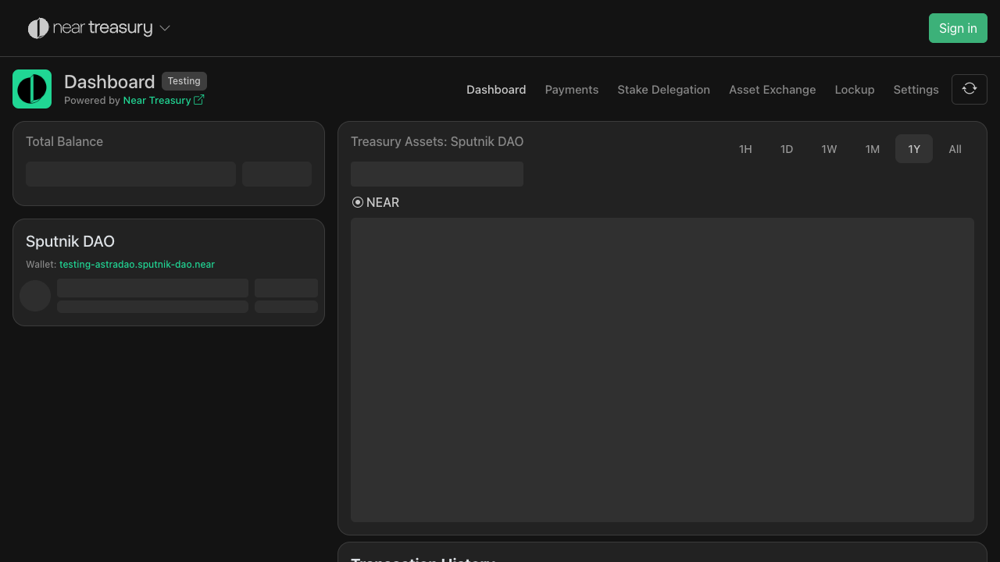
*Dashboard view when no NEAR Intents assets are present*

## Deposit Flow

### 1. Deposit Button

*Initial state showing the green deposit button in the treasury interface*

### 2. Deposit Modal - Default Tab
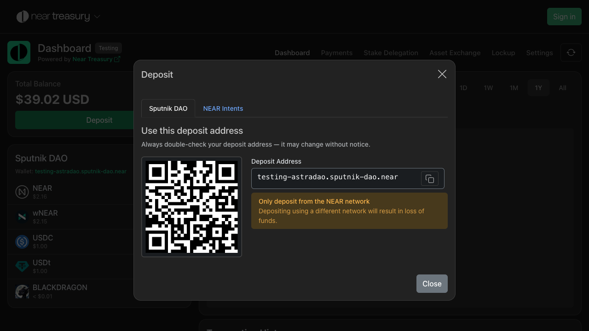
*Deposit modal opened on the default Sputnik tab*

### 3. Deposit Modal - NEAR Intents Tab

*Deposit modal switched to NEAR Intents tab showing cross-chain deposit options*

## Asset Examples by Network

### Ethereum Mainnet (eth:1)

#### Ethereum (ETH)

#### USD Coin (USDC)

#### Uniswap Token (UNI)

#### Chainlink Token (LINK)
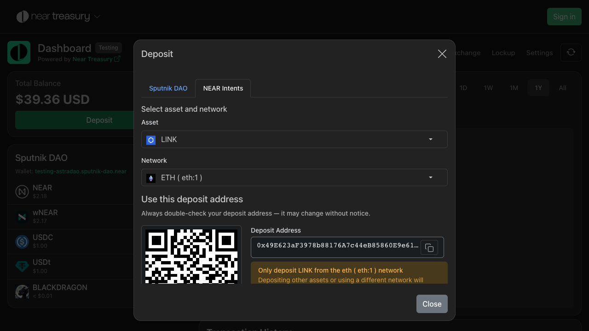

#### Pepe Token (PEPE)

#### MOG Token (MOG)

#### Kyber Network Crystal (KNC)

#### HackenAI (HAPI)

#### USD Futures (USDf)

### Layer 2 Networks

#### Arbitrum (eth:42161)

##### USDC on Arbitrum
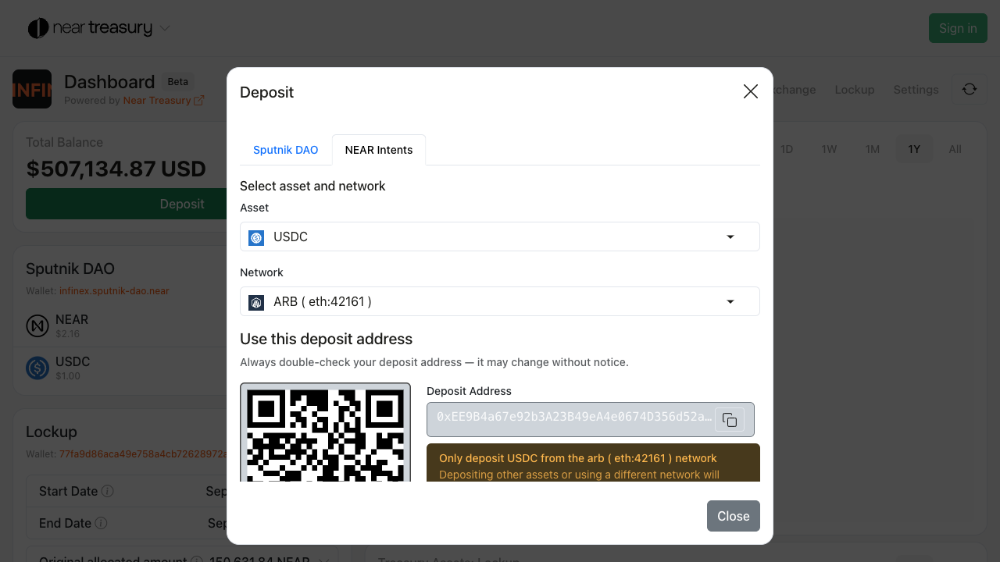

##### Ethereum on Arbitrum

##### GMX Token

#### Base (eth:8453)

##### USDC on Base

##### Ethereum on Base
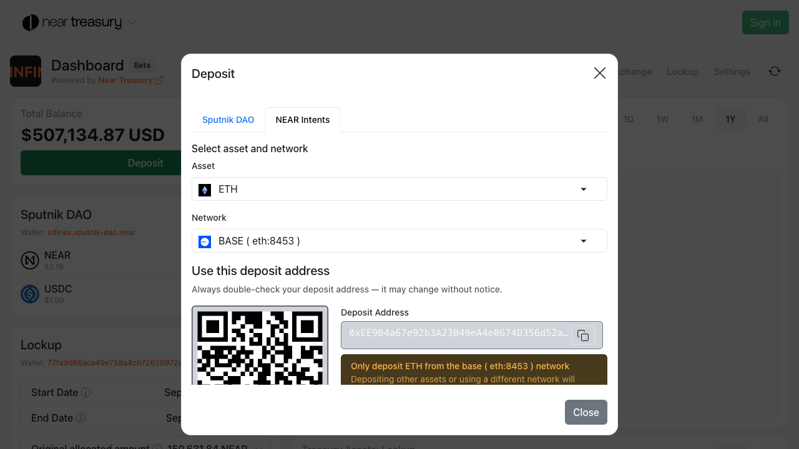

#### Gnosis Chain (eth:100)

##### USDC on Gnosis

##### Wrapped Ethereum on Gnosis

##### xDAI Token

##### Safe Token

### NEAR Protocol (near:mainnet)

#### Wrapped NEAR (wNEAR)

#### NEAR Token
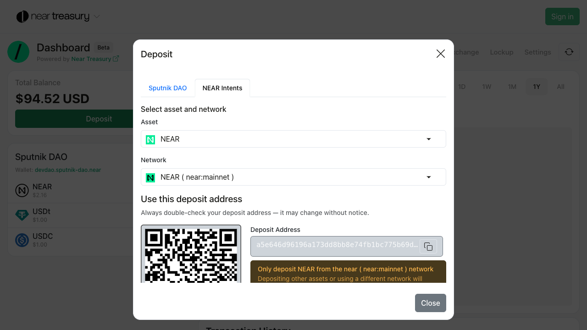

#### USDC on NEAR

#### Ref Finance Token (REF)

#### Ethereum on NEAR

#### FRAX Token

#### Aurora Gaming (ABG)

#### Black Dragon (BLACKDRAGON)
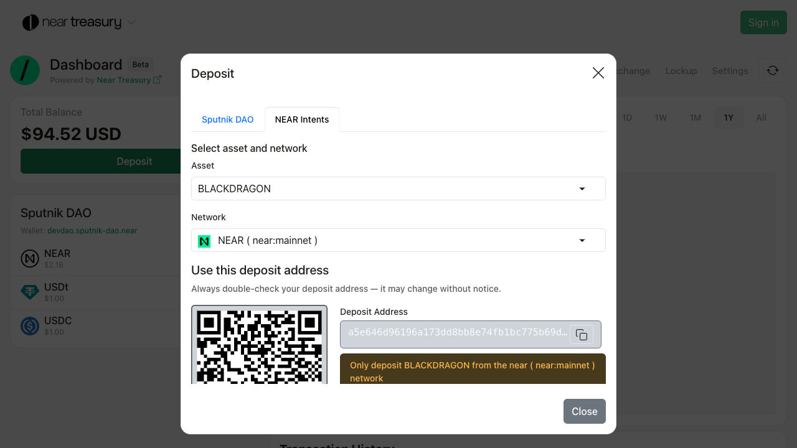

#### mp DAO Token

#### GNEAR Token

### Solana (sol:mainnet)

#### USDC on Solana

#### Book of Meme (BOME)

#### LOUD Token

#### Melania Token (MELANIA)
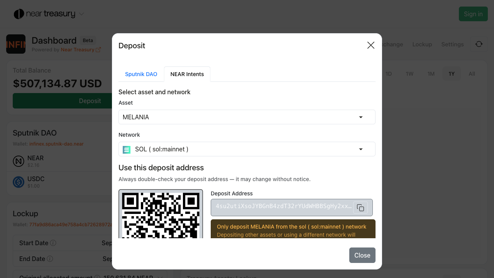

### Bitcoin (btc:mainnet)

#### Bitcoin (BTC)

### Dogecoin (doge:mainnet)

#### Dogecoin (DOGE)

### Zcash (zec:mainnet)

#### Zcash (ZEC)
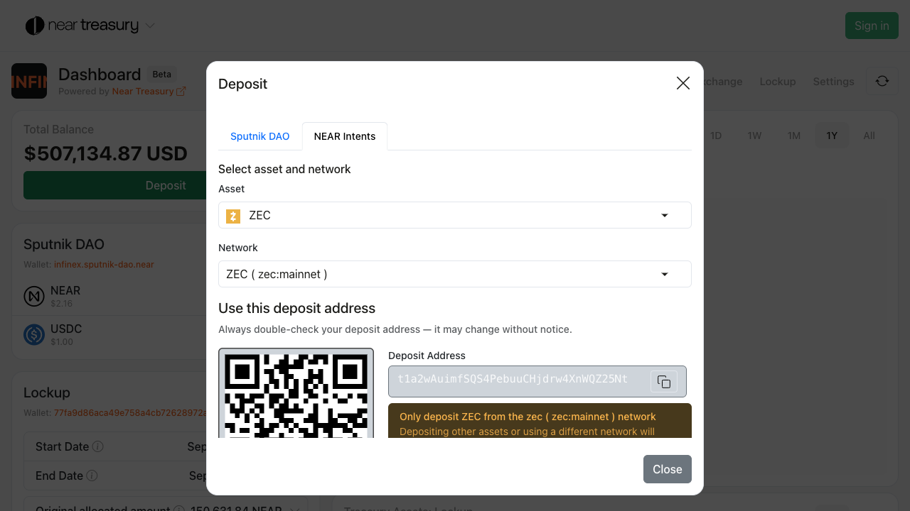

### Tron (tron:mainnet)

#### Tron (TRX)
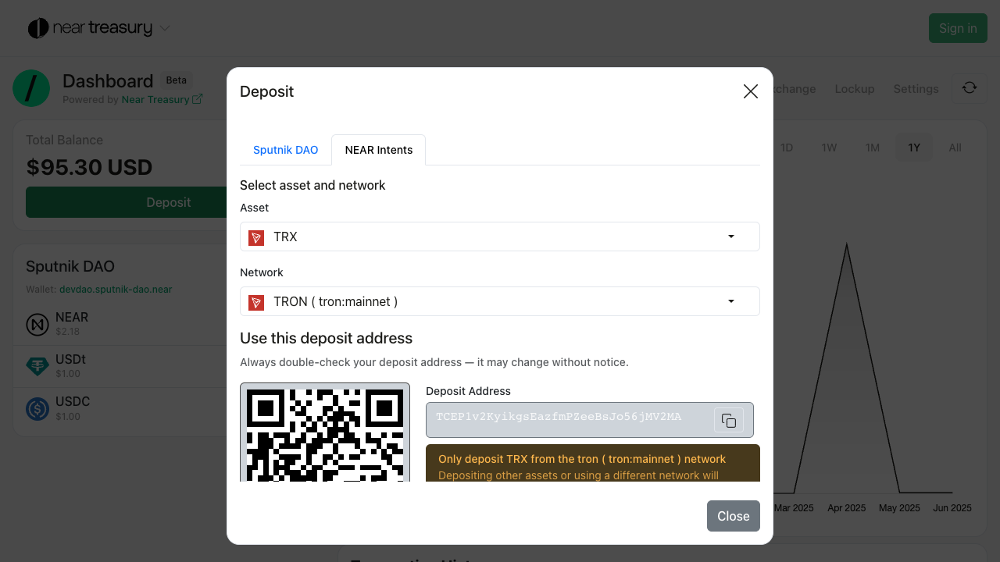

## Payment Requests

### Create Payment Request Form
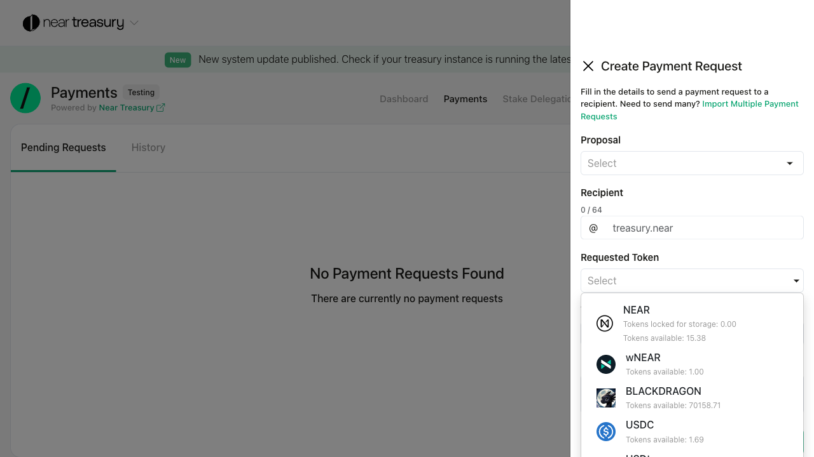
*Payment request interface with token selection dropdown opened, showing available NEAR Intents assets including BTC (NEAR Intents), USDC, and wNEAR that can be used for cross-chain payments*

## Usage Notes

- All screenshots were captured using automated Playwright tests to ensure accuracy
- QR codes shown are functional and can be used for actual deposits in test environments
- Asset availability may vary based on network conditions and bridge configurations
- Screenshots demonstrate the complete user flow from dashboard to deposit completion

## Technical Details

- **Screenshot Format**: PNG with full-page capture
- **Resolution**: High-resolution suitable for documentation
- **Consistency**: All screenshots use the same browser environment and settings
- **Accessibility**: Images include descriptive alt text and captions

---

*Generated automatically from Playwright test runs. Last updated: June 2025*
