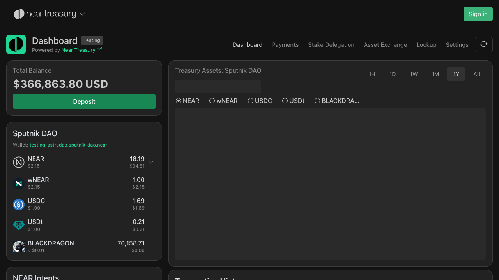

# NEAR Intents User Guide

## Overview

NEAR Intents is a powerful feature of the Treasury Dashboard that enables cross-chain asset management and payment processing. This system allows DAOs to receive deposits from multiple blockchain networks and create payment requests for various cryptocurrencies while maintaining assets in a unified interface.

## Table of Contents

1. [Dashboard Overview](#dashboard-overview)
2. [Making Deposits](#making-deposits)
3. [Creating Payment Requests](#creating-payment-requests)
4. [Asset Management](#asset-management)
5. [Multi-Chain Support](#multi-chain-support)
6. [Troubleshooting](#troubleshooting)

## Dashboard Overview

The NEAR Intents dashboard integrates seamlessly into the Treasury Dashboard, providing a comprehensive view of your cross-chain assets.

### Key Features

- **Total Balance Display**: Shows combined USD value of all assets across chains
- **NEAR Intents Card**: Dedicated section displaying cross-chain asset balances
- **Real-time Updates**: Automatic balance updates when new deposits are received
- **Multi-Chain Visibility**: Assets from Ethereum, Bitcoin, Solana, Base, and other networks

### Dashboard Components

1. **Total Balance Card**: 
   - Displays aggregate USD value including NEAR Intents assets
   - Features a green "Deposit" button for new deposits
   - Updates automatically when intents balances change

2. **NEAR Intents Section**:
   - Shows individual asset balances
   - Displays assets from all supported networks
   - Includes icons for each blockchain and asset

### Dashboard Views

**Dashboard with NEAR Intents Balance:**

**Dashboard without NEAR Intents:**

## Making Deposits

NEAR Intents supports deposits from multiple blockchain networks into your DAO treasury.

### Supported Networks

- **NEAR Protocol** (mainnet)
- **Ethereum** (eth:1)
- **Bitcoin** (btc:mainnet)
- **Solana** (sol:mainnet)
- **Base** (eth:8453)
- **Arbitrum** (eth:42161)
- **XRP Ledger** (xrp:mainnet)
- **Tron** (tron:mainnet)

### How to Make a Deposit

1. **Access Deposit Interface**
   - Click the green "Deposit" button in the Total Balance card
   - The deposit modal will open with asset selection

2. **Select Asset and Network**
   - Browse available assets or use the search function
   - Select the blockchain network (displayed with human-readable names)
   - Each network shows its native name (e.g., "ETH" for Ethereum, "BTC" for Bitcoin)

3. **Switch to NEAR Intents Tab**
   - Click on the "NEAR Intents" tab to access cross-chain deposits
   - This shows all supported assets and networks

4. **Get Deposit Address**
   - The system generates a unique deposit address for your selected asset/network
   - QR codes are automatically generated for easy mobile wallet scanning
   - Copy the address or scan the QR code with your wallet

**Example Deposit QR Codes:**

*USDC deposit on Ethereum mainnet*

*NEAR token deposit on NEAR mainnet*

*Bitcoin deposit on Bitcoin mainnet*

5. **Complete the Deposit**
   - Send your assets to the provided address
   - Deposits are processed automatically through the bridge infrastructure
   - Assets appear in your dashboard once confirmed on the source network

### Deposit Interface Features

- **Asset Search**: Type to find specific tokens quickly
- **Network Icons**: Visual indicators for each blockchain
- **QR Code Generation**: Automatic QR codes for mobile wallet convenience
- **Address Validation**: Built-in checks to ensure proper addresses
- **Tab Navigation**: Switch between different deposit methods

### Cross-Chain Asset Examples

The system supports deposits across multiple networks. Here are examples of popular assets:

**Ethereum Network Assets:**

*Ethereum (ETH) on Ethereum mainnet*

*USDC stablecoin on Ethereum mainnet*

**Multi-Chain USDC Support:**

*USDC on Arbitrum (Layer 2)*

*USDC on Base (Layer 2)*

*USDC on Solana*

**Popular DeFi Tokens:**

*Uniswap (UNI) token on Ethereum*

*Chainlink (LINK) token on Ethereum*

**NEAR Ecosystem Assets:**

*Wrapped NEAR (wNEAR) on NEAR mainnet*

*Ref Finance (REF) token on NEAR*

### Supported Assets

The system supports a wide range of assets including:
- **Native tokens**: ETH, BTC, SOL, XRP, TRX
- **Stablecoins**: USDC, USDT, DAI
- **DeFi tokens**: AAVE, UNI, COMP
- **NEAR ecosystem**: wNEAR, REF, AURORA
- **Memecoins**: SHITZU, PEPE, DOGE

## Creating Payment Requests

NEAR Intents enables DAOs to create payment requests that utilize cross-chain assets for disbursements.

### Payment Request Types

1. **Cross-Chain Payments**: Send BTC, ETH, or other assets to external addresses
2. **NEAR Native Payments**: Transfer wNEAR or other NEAR tokens
3. **Multi-Asset Support**: Choose from any available asset in your treasury

### Creating a Payment Request

1. **Access Payment Interface**
   - Navigate to the payment request section
   - Select "Create New Payment Request"

2. **Configure Payment Details**
   - **Recipient**: Enter the destination address
   - **Asset**: Choose from available treasury assets
   - **Amount**: Specify the payment amount
   - **Description**: Add context for the payment

*Create Payment Request interface showing the token selection dropdown with available NEAR Intents assets including BTC, USDC, and wNEAR*

3. **Address Validation**
   - The system validates recipient addresses for the selected network
   - Format checking ensures compatibility with the target blockchain
   - Network-specific validation prevents errors

4. **Submit for Approval**
   - Payment requests follow standard DAO governance processes
   - Council members vote on approval
   - Approved payments are executed automatically

### Payment Request Examples

**Bitcoin Payment Request**:

**wNEAR Payment Request**:

### Balance Validation

The system includes sophisticated balance validation:
- **Insufficient Balance Alerts**: Prevents requests exceeding available funds
- **Real-time Balance Checks**: Updates as treasury balances change
- **Multi-Asset Validation**: Checks balances across all networks

## Asset Management

### Token Amount Display

The interface provides clear token amount display with several features:

- **Decimal Precision**: Proper handling of different token decimals
- **Tilde Logic**: Smart formatting for very small amounts using "~" notation
- **USD Value Display**: Real-time USD equivalent when enabled
- **Edge Case Handling**: Proper display for extreme values

### Features

1. **Smart Formatting**:
   - Displays amounts with appropriate decimal places
   - Uses tilde (~) for very small amounts
   - Shows significant digits clearly

2. **USD Value Integration**:
   - Real-time price conversion
   - Toggle between token amounts and USD values
   - Accurate pricing from multiple data sources

## Multi-Chain Support

### Network Display

The system presents blockchain networks with user-friendly names:

- **Human-Readable Names**: "ETH" instead of "eth:1"
- **Network Icons**: Visual indicators for each blockchain
- **Chain ID Mapping**: Proper mapping between display names and technical identifiers

### Supported Networks

| Display Name | Technical ID | Assets Supported |
|--------------|-------------|------------------|
| ETH | eth:1 | USDC, USDT, WETH, AAVE, UNI |
| BTC | btc:mainnet | BTC |
| SOL | sol:mainnet | SOL, USDC |
| BASE | eth:8453 | USDC, BRETT, DEGEN |
| ARB | eth:42161 | USDC, GMX, ARB |
| NEAR | near:mainnet | wNEAR, REF, AURORA |
| XRP | xrp:mainnet | XRP |
| TRON | tron:mainnet | TRX, USDT |

### Cross-Chain Bridge Integration

NEAR Intents utilizes advanced bridge infrastructure:
- **Omni-Chain MFT (OMFT)**: Multi-fungible token standard for cross-chain assets
- **Automated Bridging**: Seamless asset movement between networks
- **Security**: Multi-signature validation and timelock mechanisms
- **Monitoring**: Real-time transaction tracking and confirmation

## Security Features

### Address Validation

The system includes comprehensive address validation:
- **Format Checking**: Ensures addresses match network requirements
- **Checksum Validation**: Prevents errors from invalid addresses
- **Network Compatibility**: Confirms addresses work with selected networks

### Balance Protection

- **Real-time Balance Checks**: Prevents overdrafts
- **Multi-Signature Requirements**: DAO approval for all transactions
- **Slippage Protection**: Guards against price manipulation
- **Gas Fee Estimation**: Accurate cost calculations

### Audit Trail

- **Transaction Logging**: Complete history of all operations
- **Proposal Tracking**: Links payments to governance proposals
- **Multi-Chain Monitoring**: Tracks assets across all networks
- **Reporting**: Comprehensive financial reporting tools

## Troubleshooting

### Common Issues

1. **Deposit Not Appearing**
   - Check transaction status on source blockchain
   - Verify minimum confirmation requirements
   - Ensure correct deposit address was used
   - Contact support if delayed beyond expected timeframe

2. **Payment Request Failures**
   - Verify sufficient balance in treasury
   - Check recipient address format
   - Ensure network compatibility
   - Review gas fee requirements

3. **Balance Display Issues**
   - Refresh the dashboard
   - Check network connectivity
   - Verify RPC endpoint status
   - Clear browser cache if necessary

### Error Messages

- **"Insufficient Balance"**: Treasury lacks required funds for payment
- **"Invalid Address"**: Recipient address format is incorrect
- **"Network Mismatch"**: Asset not supported on selected network
- **"Proposal Required"**: Payment exceeds single-signer limit

### Support Resources

- **Documentation**: Comprehensive guides and API references
- **Community Support**: Discord and forum assistance
- **Technical Support**: Direct support for critical issues
- **Status Page**: Real-time system status and maintenance updates

## Best Practices

### For DAOs

1. **Regular Monitoring**: Check balances and pending transactions daily
2. **Diversification**: Maintain assets across multiple networks for redundancy
3. **Governance**: Establish clear approval processes for different payment sizes
4. **Documentation**: Keep records of all cross-chain transactions

### For Users

1. **Address Verification**: Always double-check recipient addresses
2. **Small Test Transactions**: Start with small amounts for new networks
3. **Network Awareness**: Understand gas fees and confirmation times
4. **Backup Plans**: Have alternative payment methods available

### Security

1. **Multi-Signature**: Require multiple approvals for large transactions
2. **Regular Audits**: Periodic review of all cross-chain assets
3. **Access Control**: Limit proposal creation to trusted members
4. **Monitoring**: Set up alerts for unusual transaction patterns

---

*This documentation is based on extensive testing of the NEAR Intents system and reflects the current capabilities as of June 2025. For the most up-to-date information, please refer to the official NEAR DevHub documentation.*
